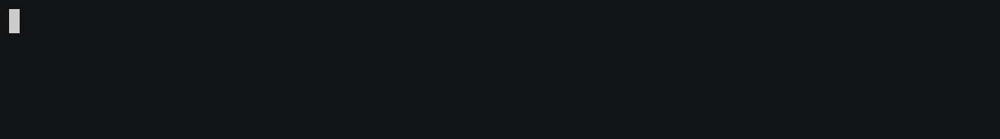

# rucline
[](https://github.com/m-lima/rucline/actions?workflow=build)
[](LICENSE)
[](https://crates.io/crates/rucline)
[](https://docs.rs/rucline)


> Code for demo above available at [examples/multiple.rs](../../blob/master/examples/multiple.rs)

Rucline, the Rust CLI Line reader, or simply "recline", is a cross-platform, UTF-8 compatible
line reader that provides hooks for autocompletion and tab suggestion. It supports advanced
editing [`actions`] and hooks for customizing the line reader behavior making it more flexible
than simply reading from `stdin`.

#### Basic usage:

```rust
use rucline::completion::Basic;
use rucline::Prompt;

if let Ok(Some(string)) = Prompt::from("What's you favorite website? ")
    // Add some tab completions (Optional)
    .suggester(&Basic::new(&[
        "https://www.rust-lang.org/",
        "https://docs.rs/",
        "https://crates.io/",
    ]))
    //Block until value is ready
    .read_line()
{
    println!("'{}' seems to be your favorite website", string);
}
```

## Actions

Rucline's behavior can be customized and composed with use of [`actions`].

There is a built-in set of default [`actions`] that will be executed upon user interaction.
These are meant to feel natural when coming from the default terminal, while also adding further
functionality and editing commands. For example, a few of the built-ins:
* `Tab`: cycle through completions
* `Shift` + `Tab`: cycle through completions in reverse
* `CTRL` + `W`: delete the current word
* `CTRL` + `J`: delete until the beginning of the word
* `CTRL` + `K`: delete until the end of the word
* `CTRL` + `U`: delete the whole line
* `CTRL` + `H`: delete until the beggining of the line
* `CTRL` + `L`: delete until the end of the line

> See [`Action`][`actions`] for the full default behavior specification

The default behavior can be customized by overriding user [`events`] with [`actions`]. Which
in turn can be serialized, stored, and loaded at run-time.


#### Overriding key bindings

```rust
use rucline::{completion::Basic, Prompt};
use rucline::actions::{Action, Event, KeyBindings, Range};
use crossterm::event::KeyCode;

let mut bindings = KeyBindings::new();

// Accept the full suggestions if `right` is pressed
bindings.insert(Event::from(KeyCode::Right), Action::Complete(Range::Line));

if let Ok(Some(string)) = Prompt::from("What's you favorite website? ")
    // Add some likely values as completions
    .completer(&Basic::new(&[
        "https://www.rust-lang.org/",
        "https://docs.rs/",
        "https://crates.io/",
    ]))
    // Set the new key bindings as an override
    .overrider(&bindings)
    //Block until value is ready
    .read_line()
{
    println!("'{}' seems to be your favorite website", string);
}
```

[`crossterm`]: https://docs.rs/crossterm/
[`KeyBindings`]: ../../blob/master/src/actions.rs
[`actions`]: ../../blob/master/src/actions.rs
[`events`]: ../../blob/master/src/actions.rs
[`prompt`]: ../../blob/master/src/prompt/mod.rs
